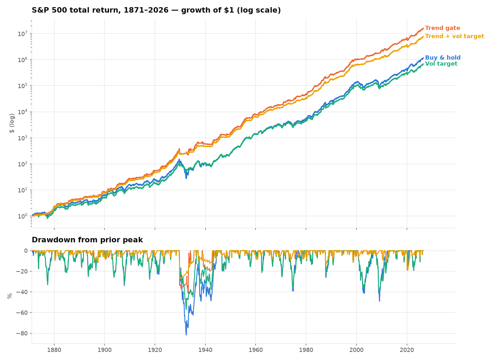
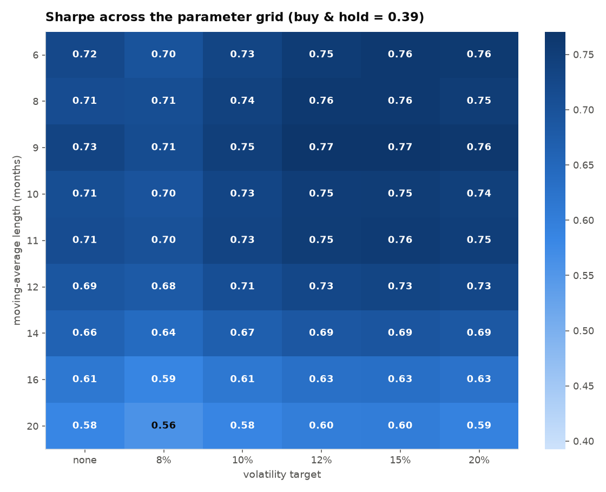
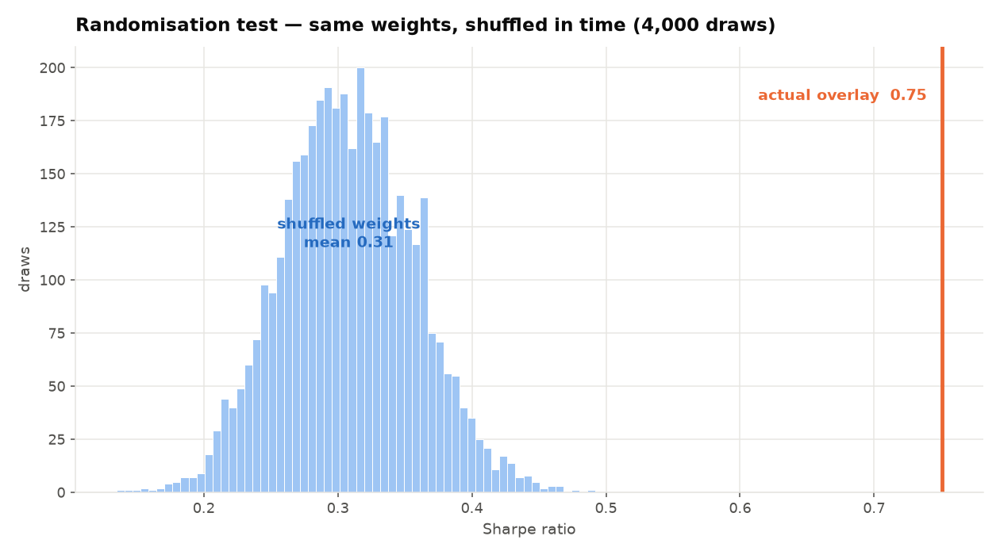
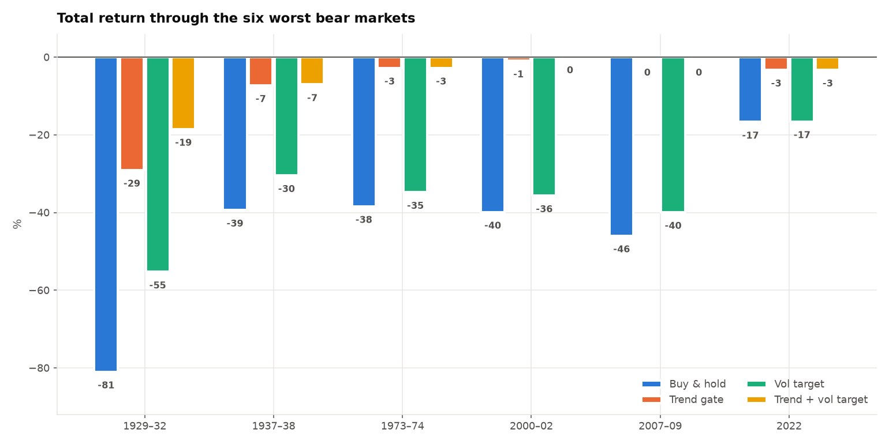

# VRO — Volatility-Regime Overlay

A TradingView indicator built by testing candidate edges until one survived, and
reporting what happened to the ones that didn't.

**What it does.** On every bar it answers a single question — *how much of this
asset should I be holding right now?* — and nothing else. It does not predict
direction.

```
target weight  =  [ trend gate: 0 or 1 ]  ×  min( target vol ÷ realised vol , cap )
```

**The headline result**, on S&P 500 monthly total returns from 1871 to 2026:

| | CAGR | Volatility | **Sharpe** | **Max drawdown** |
|---|---|---|---|---|
| Buy & hold | 9.39% | 14.01% | 0.39 | −81.8% |
| Trend gate only | 11.25% | 9.42% | 0.71 | −41.0% |
| Vol targeting only | 9.07% | 11.58% | 0.42 | −57.1% |
| **Trend gate + vol targeting** | **10.80%** | **8.21%** | **0.75** | **−27.3%** |

Higher return, 40% less volatility, and a third of the drawdown. Read the
[limitations](#limitations--when-this-loses) before trading it — there is a real
cost, and it is paid in exactly the market we've had recently.



---

## Files

| Path | What it is |
|---|---|
| `pine/VRO_indicator.pine` | The indicator — regime shading, target weight, status panel, alerts |
| `pine/VRO_strategy.pine` | Same logic wired to the TradingView Strategy Tester |
| `backtest/run_all.py` | Runs the entire study end to end |
| `backtest/screen_signals.py` | Screens 15 candidate signals for edge |
| `backtest/reversal_study.py` | The idea that failed, kept reproducible |
| `backtest/longrun_regime.py` | The 156-year out-of-sample test |
| `backtest/robustness.py` | Parameter grid, costs, sub-samples, randomisation test |
| `backtest/daily_validation.py` | Daily-frequency check across 486 S&P names |
| `backtest/pine_parity.py` | Proves the Pine script implements the tested rule |

```bash
pip install -r backtest/requirements.txt
python backtest/run_all.py          # downloads data on first run
```

Data is fetched from public mirrors: the S&P 500 daily OHLCV panel (505 tickers,
2013–2018) from `plotly/datasets`, and Shiller's monthly S&P 500 series
(1871–2026) from `datasets/s-and-p-500`.

---

## How this was built

### 1. Most of what I tested didn't work

Fifteen candidate signals, each scored by its cross-sectional decile spread of
forward returns, averaged per day and tested with a Newey–West t-stat.

**Averaging per day before testing is the whole ballgame.** Stock returns are
enormously correlated across names, so a t-stat computed on the pooled panel
overstates significance by roughly √(number of stocks). That single correction
is what turns most "edges" into noise.

Nothing cleared a convincing bar. Momentum, 52-week-high proximity, volume
surges, overnight/intraday decomposition, gap fades — all noise, most flipping
sign year to year. The two highest t-stats (`illiq`, `amihud`, both ~2.4–2.9)
are illiquidity tilts, and I discarded them: the dataset is S&P 500 membership
*as of 2018*, so the illiquid names that survived to be in it are survivors by
construction. That is survivorship bias wearing a lab coat.

### 2. The idea that looked great and wasn't

Short-horizon reversal — buy what has fallen furthest below its own recent mean
— is what most retail "quant" indicators are built on. It looked excellent:

```
all trend-gate days (baseline)     mean 5d = 0.204%
trend & z < -1.5                   mean 5d = 0.465%     <- more than double
trend & z > 1.5 (recent winners)   mean 5d = 0.095%
```

Losers beat winners by ~0.35pp per five days. Then the control:

```
cross-sectional decile spread:  mean 0.034%   t = 0.51
  2013 +0.194  2014 +0.041  2015 -0.150  2016 +0.275  2017 -0.070  2018 -1.180
```

Zero, with the sign flipping every year. The apparent edge was **beta timing**:
the signal fires when the whole market is down, and gets paid when it bounces.
In 2013–2018 it always bounced. Net of the market's own move on the same days,
the excess is 0.070% with t = 1.19 — nothing.

Run `backtest/reversal_study.py` to reproduce all three steps. The full
trade-level simulator for it (next-open fills, ATR stop, time stop, costs) is
kept in `backtest/vnr.py` as the research record.

### 3. What survived, and why it's different

The one thing that held up was not a return forecast. **Volatility is
persistent and forecastable in a way that returns are not** — and that is the
only free lunch on offer. Two ways to use it:

- **Trend gate** — hold the asset only while it's above a long moving average
  that is itself rising. (Moskowitz–Ooi–Pedersen 2012; Faber 2007.)
- **Volatility targeting** — scale exposure by inverse realised volatility.
  (Moreira–Muir 2017.)

Neither predicts direction. Both manage exposure. The 2013–2018 daily panel
can't evaluate them, because an overlay whose job is cutting risk in bear
markets is untestable in a sample with no bear market — so I tested them on 156
years of monthly data instead.

---

## Robustness

**Is the parameter a plateau or a spike?** All 54 combinations of moving-average
length (6–20 months) × volatility target (none, 8–20%) beat buy & hold. Range
0.56–0.77 against 0.39. Broad plateau, gentle decay past 14 months, no cliff.



**Does it survive costs?** It trades **0.67 round trips per year**. At 100bp per
side — an absurd cost for a liquid ETF — Sharpe is still 0.59 vs 0.39. Low
turnover is the reason this survives where the reversal strategy would have been
destroyed.

| Cost (bps/side) | 0 | 5 | 10 | 25 | 50 | 100 |
|---|---|---|---|---|---|---|
| Sharpe | 0.75 | 0.74 | 0.73 | 0.71 | 0.67 | 0.59 |

**Is it an artifact of 19th-century data?** Shiller's pre-1926 figures are
monthly averages of daily closes, which flatters any trend rule. Excluding them
changes nothing:

| Sample | Buy & hold Sharpe | Overlay Sharpe |
|---|---|---|
| Full 1871–2026 | 0.39 | 0.75 |
| Post-1926 | 0.42 | 0.78 |
| Post-1950 | 0.53 | 0.77 |
| Post-1990 | 0.56 | 0.77 |

**Does it hold up era by era?** Sharpe in quarter-century blocks. The overlay
wins five of six; the exception is 1975–2000, an uninterrupted bull market —
the same shape as the 2013–2018 daily result.

| | 1871–1900 | 1900–25 | 1925–50 | 1950–75 | 1975–2000 | 2000–26 |
|---|---|---|---|---|---|---|
| Buy & hold | 0.27 | 0.35 | 0.31 | 0.51 | **0.68** | 0.42 |
| Trend + vol target | **0.51** | **0.80** | **0.87** | **0.94** | 0.63 | **0.76** |

**Is it better than luck?** Shuffle the overlay's weights in time — same weights,
same average exposure, same leverage distribution, random timing — 4,000 times.
Real Sharpe 0.751; null mean 0.307, sd 0.050. **p < 0.0005**, roughly nine
standard deviations. The real overlay's drawdown (−27.3%) was shallower than
100% of the shuffles (null mean −63.4%).



**Where the drawdown protection comes from:**



**Does the Pine script actually do this?** `backtest/pine_parity.py`
re-implements the Pine order block step for step — rebalance band, commission,
slippage, weight drift between trades — and compares it to the research weights.
Sharpe gap **0.006**. This check caught two real bugs during development: a
slope filter the monthly study didn't use, and the moving average being computed
on the total-return series instead of the price series.

---

## Limitations — when this loses

Take these seriously; they are the honest price of the results above.

1. **It underperforms in sustained bull markets.** This is not a caveat, it's
   the mechanism. On the 2013–2018 daily panel — 486 names, no bear market —
   buy & hold returned 13.8% CAGR at Sharpe 1.09; the overlay returned 5.0% at
   Sharpe 0.63. It cut drawdown (16.4% → 10.8%) and cost a lot of return. The
   monthly study shows the same thing in 1975–2000, the one era out of six where
   the overlay lost (Sharpe 0.63 vs 0.68). You are buying crash insurance and
   the premium is real.

2. **It does not protect against fast crashes.** The gate needs a sustained
   decline to trigger. In the February 2018 vol spike it gave *zero* protection
   (−5.84% either way). It would not have saved you in October 1987 or the first
   week of COVID. It works against 2000–02 and 2007–09, not against a gap down.

3. **The strong evidence is monthly and index-level.** The Pine script runs on
   daily bars using a 200-day MA as the equivalent of the tested 10-month MA.
   Use it on broad index ETFs (SPY, QQQ, VTI), which is what was tested. On
   single stocks it is much noisier — across 486 names only 11.7% beat their own
   buy & hold on Sharpe.

4. **Trend following is the most data-mined rule in finance.** 156 years and
   5 of 6 quarter-century eras is about as good as this field's evidence gets,
   but everyone has seen this result, and a well-known edge is a crowded one.

5. **Dataset caveats.** The daily panel has survivorship bias (2018 membership).
   Dividends in the monthly series are missing after 2023-06 and forward-filled,
   affecting the last 3 of 156 years.

6. **The backtest assumes cash earns the risk-free rate** while out of the
   market, and ignores taxes. Roughly a third of the time you are in cash, and
   in a taxable account the realised gains are a real drag.

---

## Using it

1. Open TradingView → **Pine Editor** → paste `pine/VRO_indicator.pine` → **Add
   to chart**. Use a **daily** chart on a broad index ETF.
2. The status panel shows the regime, the target weight, realised volatility,
   and where current volatility sits against its own history.
3. Green background = risk on, orange = risk off. Triangles mark regime flips.
4. Three alerts: regime turns risk-on, regime turns risk-off, and target weight
   moves more than 15 percentage points.
5. For the Strategy Tester, use `pine/VRO_strategy.pine`. Defaults are the tested
   settings (200-bar MA, 12% target vol, no leverage, 15pp rebalance band, 3bp
   commission, 2-tick slippage).

**Read the target weight as a fraction of the capital you'd allocate to this
position anyway.** A weight of 0.6 means 60% of the sleeve, not 60% of your net
worth.

Signals are computed on closed bars and filled at the next bar's open; there is
no `request.security` lookahead anywhere in either script.

---

*Backtested results are not indicative of future performance. This is research
code and educational material, not investment advice.*
